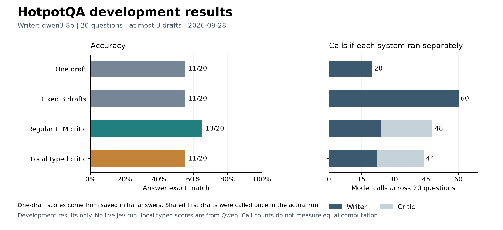

# Meeting notes

The local comparison is working, and the code and measured results are on the `Yash` branch. The remaining step is a live Jev run. The adapter passed the offline tests, but it still needs a TypeSafe key before we can check authentication and actual model behavior.

## A short explanation to start with

"I built a loop where a local model answers a HotpotQA question and a critic decides whether to accept it or request another draft. I ran 20 development questions. The regular critic corrected two initially wrong answers, going from 11 to 13 exact matches. Taking three drafts every time and using the local typed critic both stayed at 11. I have the Jev adapter ready, but I don't have a live Jev result yet."



The [checked results](../results/hotpotqa-dev-20-20260928/analysis.md) include F1, repairs, and incorrect approvals under exact match. The [raw traces](../results/hotpotqa-dev-20-20260928/traces.jsonl) retain the actual drafts and critic outputs.

## Questions the professor might ask

**What did you implement?**

"I set up HotpotQA with all the supplied passages, a local Qwen3 8B writer, interchangeable critics, and a bounded revision loop. I also added answer scoring, saved traces, and a spending guard for Jev. All 60 local episodes finished, and the 63 automated tests pass."

**Is this reinforcement learning?**

"There's no training here. I'm using pretrained models and changing the answer checker that decides when the revision loop should stop. The critic isn't an RL value network."

**Why does the comparison use the same initial answer?**

"It stops one critic from getting an easier starting point. Later drafts can differ because the feedback differs, so the current experiment compares the complete revision systems. To isolate stopping decisions, we'd need each critic to judge identical saved draft sequences."

**Does fewer drafts mean less computation?**

"Checking an answer also takes a model call. The regular critic used 24 writer calls and 24 critic calls. That's 48 calls if run by itself, compared with 60 for fixed revision and 20 for one draft. Calls also differ in prompt and output length, so I keep token counts and timing in the records."

| System | Writer calls | Critic calls | Total if run separately | Exact matches |
| --- | ---: | ---: | ---: | ---: |
| One draft | 20 | 0 | 20 | 11/20 |
| Fixed three drafts | 60 | 0 | 60 | 11/20 |
| Regular LLM critic | 24 | 24 | 48 | 13/20 |
| Local typed critic | 22 | 22 | 44 | 11/20 |

The actual three-system experiment made 112 calls because it reused the 20 first drafts. The one-draft baseline was derived from those saved drafts, with no additional inference. Hosted API spend was $0; local electricity and hardware are not priced.

**Is the local typed critic Jev?**

"No. It asks Qwen to score support, completeness, and relevance, then uses the same approval rule and repair templates as the Jev adapter. Those scores are uncalibrated. They help test the design, but they don't tell us how Jev will perform."

**Why is the threshold 0.8?**

"It's a starting setting. All three checks have to reach it, so high relevance can't compensate for low support. I still need to choose the threshold on development examples and freeze it before the held-out run."

**Are all the false approvals factual mistakes?**

"They're approvals of answers that failed exact match: 7 out of 19 for the regular critic and 9 out of 19 for the typed critic. Some failures can be wording differences. I also keep F1 and the raw answers so we can review those cases. One clear mistake was answering 2005 when the reference was 2006; the typed critic accepted it, while the regular critic prompted a correction."

The second correction changed "modern dance" to "Laban Movement Analysis" for a question about Gerd Neggo's teacher. Source IDs for the two corrections are `5ac240ef55429951e9e684ef` and `5a8f0986554299458435d535`. These examples show what happened on those questions, not that every explanation generated by the critic is reliable.

**What can you conclude, and what's left?**

"The pipeline works, and the regular critic repaired two answers in this run. Twenty development questions aren't enough to claim a general improvement. I've kept 80 questions separate for later evaluation. Both groups come from HotpotQA's public development release, so the 80 aren't its official hidden test set. Next is the live Jev development comparison, followed by frozen settings and the held-out run."

## Questions to ask

1. Should we compare complete revision loops, or have both critics judge identical drafts to isolate the stopping decision?
2. Should we manually review exact-match failures to separate wrong answers from acceptable wording differences?
3. Should we tune the Jev threshold to preserve baseline accuracy or target a maximum false-approval rate?

## What to open during the meeting

- [Discord update](DISCORD_UPDATE.md): the short progress message.
- [Results figure](../results/hotpotqa-dev-20-20260928/comparison.png): accuracy beside model calls.
- [Checked analysis](../results/hotpotqa-dev-20-20260928/analysis.md): the result table and its limits.
- [Integration example](INTEGRATION.md): how Vedanshi can use the critic in her harness.

To regenerate the figure from the recorded run, install the optional plotting dependency and run:

```bash
python -m pip install -e ".[plots]"
python scripts/plot_run.py results/hotpotqa-dev-20-20260928
```

This checks the recorded results and makes PNG and SVG figures. It does not call any models. Keep the saved run separate from new experiments; the harness refuses to overwrite an existing output directory.
