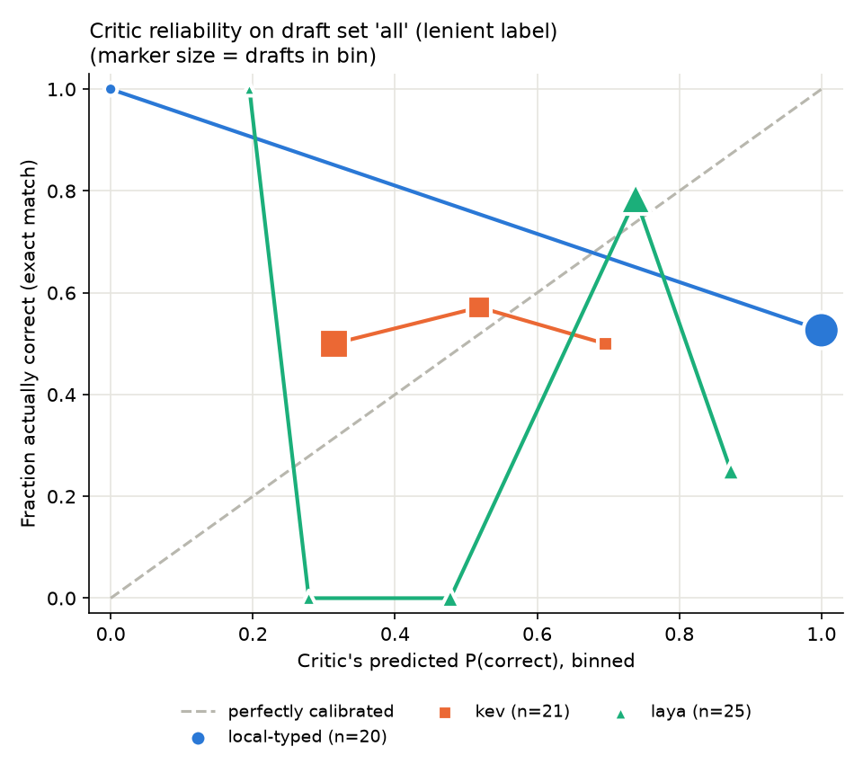

# Critic benchmark report

Label: **lenient** (exact match or token F1 >= 0.8).

## Draft set `first`: 20 drafts, 11 correct (55%)

Approving everything would be right 11/20 (55%) of the time; a useful critic beats this on accuracy when approved.

| Critic | Source | n scored | Accuracy when approved (@0.8) | Wrong approvals @0.8 | Wrongly rejected @0.8 | AUROC | Mean s/decision | Cost |
|---|---|---:|---:|---:|---:|---:|---:|---:|
| llm | reused (Yash run) | 20/20 | 10/17 (59%) | 7/9 | 1/11 | — (text only) | 7.81 | $0 (local) |
| local-typed | reused (Yash run) | 20/20 | 10/19 (53%) | 9/9 | 1/11 | 0.45 | 7.26 | $0 (local) |
| kev | reused (Sept 28 run) | 20/20 | 0/0 | 0/9 | 11/11 | 0.54 | 1.01 | $0 (local) |
| laya | new (critic-bench) | 20/20 | 0/2 (0%) | 2/9 | 11/11 | 0.48 | 0.17 | $0 (local) |

Threshold sweep (probability critics): wrong approvals / wrongly rejected

| Critic | @0.5 | @0.6 | @0.7 | @0.8 | @0.9 |
|---|---:|---:|---:|---:|---:|
| local-typed | 9 / 1 | 9 / 1 | 9 / 1 | 9 / 1 | 9 / 1 |
| kev | 3 / 7 | 1 / 10 | 0 / 10 | 0 / 11 | 0 / 11 |
| laya | 7 / 1 | 5 / 1 | 5 / 5 | 2 / 11 | 0 / 11 |

Sample size: n = 20, so any accuracy here is uncertain by roughly ±22% (95% interval, worst case p = 0.5). Accuracy-when-approved uses even fewer drafts.

## Draft set `all`: 25 drafts, 13 correct (52%)

Approving everything would be right 13/25 (52%) of the time; a useful critic beats this on accuracy when approved.

| Critic | Source | n scored | Accuracy when approved (@0.8) | Wrong approvals @0.8 | Wrongly rejected @0.8 | AUROC | Mean s/decision | Cost |
|---|---|---:|---:|---:|---:|---:|---:|---:|
| llm | reused (Yash run) | 22/25 | 12/19 (63%) | 7/9 | 1/13 | — (text only) | 7.27 | $0 (local) |
| local-typed | reused (Yash run) | 20/25 | 10/19 (53%) | 9/9 | 1/11 | 0.45 | 7.26 | $0 (local) |
| kev | reused (Sept 28 run) | 21/25 | 0/0 | 0/10 | 11/11 | 0.56 | 0.98 | $0 (local) |
| laya | new (critic-bench) | 25/25 | 1/4 (25%) | 3/12 | 12/13 | 0.55 | 0.17 | $0 (local) |

Threshold sweep (probability critics): wrong approvals / wrongly rejected

| Critic | @0.5 | @0.6 | @0.7 | @0.8 | @0.9 |
|---|---:|---:|---:|---:|---:|
| local-typed | 9 / 1 | 9 / 1 | 9 / 1 | 9 / 1 | 9 / 1 |
| kev | 3 / 7 | 1 / 10 | 0 / 10 | 0 / 11 | 0 / 11 |
| laya | 8 / 1 | 6 / 1 | 6 / 5 | 3 / 12 | 0 / 13 |

Sample size: n = 25, so any accuracy here is uncertain by roughly ±20% (95% interval, worst case p = 0.5). Accuracy-when-approved uses even fewer drafts.

