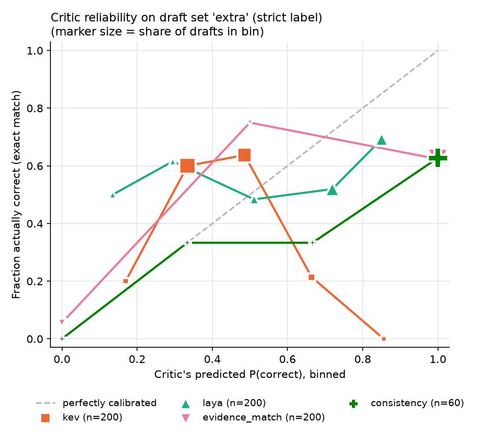

# Critic benchmark report

Label: **strict** (exact match).

## Draft set `first`: 20 drafts, 11 correct (55%)

Yes/no questions (by gold answer): 2/20. Drafts answering yes/no (evidence_match scores these 0.5): 0/20.

Approving everything would be right 11/20 (55%) of the time; a useful critic beats this on accuracy when approved.

| Critic | Source | n scored | Accuracy when approved (@0.8) | Wrong approvals @0.8 | Wrongly rejected @0.8 | AUROC | Mean s/decision | Cost |
|---|---|---:|---:|---:|---:|---:|---:|---:|
| llm | Yash's critic; saved + live | 20/20 | 10/17 (59%) | 7/9 | 1/11 | — (text only) | 7.81 | $0 (local) |
| local-typed | Yash's critic; saved | 20/20 | 10/19 (53%) | 9/9 | 1/11 | 0.45 | 7.26 | $0 (local) |
| kev | Kev-0.8B; saved + live | 20/20 | 0/0 | 0/9 | 11/11 | 0.54 | 1.01 | $0 (local) |
| laya | new | 20/20 | 0/2 (0%) | 2/9 | 11/11 | 0.48 | 0.17 | $0 (local) |
| evidence_match | new, no model | 20/20 | 11/17 (65%) | 6/9 | 0/11 | 0.67 | 0.00 | $0 (local) |
| consistency | new, 3 writer samples | 20/20 | 9/17 (53%) | 8/9 | 2/11 | 0.45 | 9.19 | $0 (local) |

Threshold sweep (probability critics): wrong approvals / wrongly rejected

| Critic | @0.5 | @0.6 | @0.7 | @0.8 | @0.9 |
|---|---:|---:|---:|---:|---:|
| local-typed | 9 / 1 | 9 / 1 | 9 / 1 | 9 / 1 | 9 / 1 |
| kev | 3 / 7 | 1 / 10 | 0 / 10 | 0 / 11 | 0 / 11 |
| laya | 7 / 1 | 5 / 1 | 5 / 5 | 2 / 11 | 0 / 11 |
| evidence_match | 6 / 0 | 6 / 0 | 6 / 0 | 6 / 0 | 6 / 0 |
| consistency | 9 / 2 | 9 / 2 | 8 / 2 | 8 / 2 | 8 / 2 |

Sample size: n = 20, so any accuracy here is uncertain by roughly ±22% (95% interval, worst case p = 0.5). Accuracy-when-approved uses even fewer drafts.

## Draft set `all`: 25 drafts, 13 correct (52%)

Yes/no questions (by gold answer): 3/25. Drafts answering yes/no (evidence_match scores these 0.5): 0/25.

Approving everything would be right 13/25 (52%) of the time; a useful critic beats this on accuracy when approved.

| Critic | Source | n scored | Accuracy when approved (@0.8) | Wrong approvals @0.8 | Wrongly rejected @0.8 | AUROC | Mean s/decision | Cost |
|---|---|---:|---:|---:|---:|---:|---:|---:|
| llm | Yash's critic; saved + live | 22/25 | 12/19 (63%) | 7/9 | 1/13 | — (text only) | 7.27 | $0 (local) |
| local-typed | Yash's critic; saved | 20/25 | 10/19 (53%) | 9/9 | 1/11 | 0.45 | 7.26 | $0 (local) |
| kev | Kev-0.8B; saved + live | 21/25 | 0/0 | 0/10 | 11/11 | 0.56 | 0.98 | $0 (local) |
| laya | new | 25/25 | 1/4 (25%) | 3/12 | 12/13 | 0.55 | 0.17 | $0 (local) |
| evidence_match | new, no model | 25/25 | 13/21 (62%) | 8/12 | 0/13 | 0.67 | 0.00 | $0 (local) |
| consistency | new, 3 writer samples | 20/25 | 9/17 (53%) | 8/9 | 2/11 | 0.45 | 9.19 | $0 (local) |

Threshold sweep (probability critics): wrong approvals / wrongly rejected

| Critic | @0.5 | @0.6 | @0.7 | @0.8 | @0.9 |
|---|---:|---:|---:|---:|---:|
| local-typed | 9 / 1 | 9 / 1 | 9 / 1 | 9 / 1 | 9 / 1 |
| kev | 3 / 7 | 1 / 10 | 0 / 10 | 0 / 11 | 0 / 11 |
| laya | 8 / 1 | 6 / 1 | 6 / 5 | 3 / 12 | 0 / 13 |
| evidence_match | 8 / 0 | 8 / 0 | 8 / 0 | 8 / 0 | 8 / 0 |
| consistency | 9 / 2 | 9 / 2 | 8 / 2 | 8 / 2 | 8 / 2 |

Sample size: n = 25, so any accuracy here is uncertain by roughly ±20% (95% interval, worst case p = 0.5). Accuracy-when-approved uses even fewer drafts.

## Draft set `extra`: 200 drafts, 115 correct (57%)

Yes/no questions (by gold answer): 12/200. Drafts answering yes/no (evidence_match scores these 0.5): 4/200.

Approving everything would be right 115/200 (57%) of the time; a useful critic beats this on accuracy when approved.

| Critic | Source | n scored | Accuracy when approved (@0.8) | Wrong approvals @0.8 | Wrongly rejected @0.8 | AUROC | Mean s/decision | Cost |
|---|---|---:|---:|---:|---:|---:|---:|---:|
| llm | Yash's critic; saved + live | 200/200 | 100/159 (63%) | 59/85 | 15/115 | — (text only) | 10.23 | $0 (local) |
| kev | Kev-0.8B; saved + live | 200/200 | 0/1 (0%) | 1/85 | 115/115 | 0.48 | 0.86 | $0 (local) |
| laya | new | 200/200 | 45/65 (69%) | 20/85 | 70/115 | 0.60 | 0.22 | $0 (local) |
| evidence_match | new, no model | 200/200 | 111/178 (62%) | 67/85 | 4/115 | 0.59 | 0.00 | $0 (local) |
| consistency | new, 3 writer samples | 60/200 | 32/51 (63%) | 19/26 | 2/34 | 0.61 | 8.70 | $0 (local) |

Threshold sweep (probability critics): wrong approvals / wrongly rejected

| Critic | @0.5 | @0.6 | @0.7 | @0.8 | @0.9 |
|---|---:|---:|---:|---:|---:|
| kev | 25 / 93 | 12 / 112 | 3 / 114 | 1 / 115 | 0 / 115 |
| laya | 67 / 22 | 57 / 30 | 40 / 39 | 20 / 70 | 1 / 110 |
| evidence_match | 68 / 1 | 67 / 4 | 67 / 4 | 67 / 4 | 67 / 4 |
| consistency | 21 / 1 | 21 / 1 | 19 / 2 | 19 / 2 | 19 / 2 |

Sample size: n = 200, so any accuracy here is uncertain by roughly ±7% (95% interval, worst case p = 0.5). Accuracy-when-approved uses even fewer drafts.

## Draft set `subset80`: 80 drafts, 45 correct (56%)

Yes/no questions (by gold answer): 5/80. Drafts answering yes/no (evidence_match scores these 0.5): 1/80.

Approving everything would be right 45/80 (56%) of the time; a useful critic beats this on accuracy when approved.

| Critic | Source | n scored | Accuracy when approved (@0.8) | Wrong approvals @0.8 | Wrongly rejected @0.8 | AUROC | Mean s/decision | Cost |
|---|---|---:|---:|---:|---:|---:|---:|---:|
| llm | Yash's critic; saved + live | 80/80 | 41/66 (62%) | 25/35 | 4/45 | — (text only) | 9.59 | $0 (local) |
| local-typed | Yash's critic; saved | 20/80 | 10/19 (53%) | 9/9 | 1/11 | 0.45 | 7.26 | $0 (local) |
| kev | Kev-0.8B; saved + live | 80/80 | 0/0 | 0/35 | 45/45 | 0.45 | 1.23 | $0 (local) |
| laya | new | 80/80 | 12/23 (52%) | 11/35 | 33/45 | 0.50 | 0.26 | $0 (local) |
| evidence_match | new, no model | 80/80 | 43/69 (62%) | 26/35 | 2/45 | 0.61 | 0.00 | $0 (local) |
| consistency | new, 3 writer samples | 80/80 | 41/68 (60%) | 27/35 | 4/45 | 0.57 | 8.82 | $0 (local) |

Threshold sweep (probability critics): wrong approvals / wrongly rejected

| Critic | @0.5 | @0.6 | @0.7 | @0.8 | @0.9 |
|---|---:|---:|---:|---:|---:|
| local-typed | 9 / 1 | 9 / 1 | 9 / 1 | 9 / 1 | 9 / 1 |
| kev | 12 / 33 | 5 / 44 | 0 / 44 | 0 / 45 | 0 / 45 |
| laya | 30 / 8 | 25 / 11 | 20 / 20 | 11 / 33 | 0 / 44 |
| evidence_match | 26 / 1 | 26 / 2 | 26 / 2 | 26 / 2 | 26 / 2 |
| consistency | 30 / 3 | 30 / 3 | 27 / 4 | 27 / 4 | 27 / 4 |

Sample size: n = 80, so any accuracy here is uncertain by roughly ±11% (95% interval, worst case p = 0.5). Accuracy-when-approved uses even fewer drafts.

